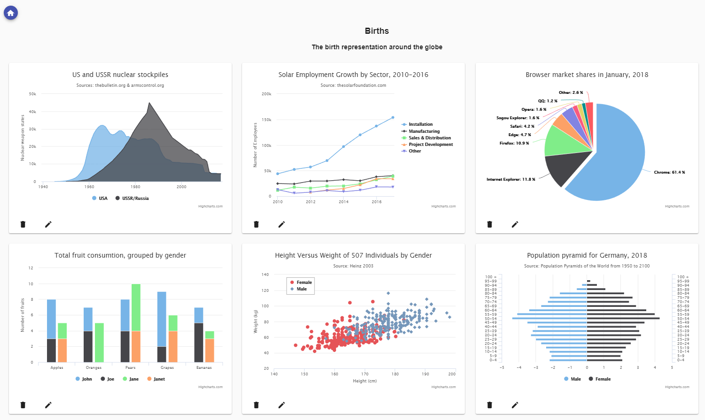

# DashboardApp

PredictX Challenge

# Preview

## Development server

Run `ng serve` for a dev server. Navigate to `http://localhost:4200/`. The app will automatically reload if you change any of the source files.

## Build

Run `ng build` to build the project. The build artifacts will be stored in the `dist/` directory. Use the `--prod` flag for a production build.

## Running unit tests

Run `ng test` to execute the unit tests via [Karma](https://karma-runner.github.io).

## Side note

`@angular/http` is deprecated, but is added only because `angular-in-memory-web-api` hase not been updated yet to use correct `@angular/common/http`.

Once [this pull request](https://github.com/angular/in-memory-web-api/pull/223) has been merged, `@angular/http` dependency will be removed.
